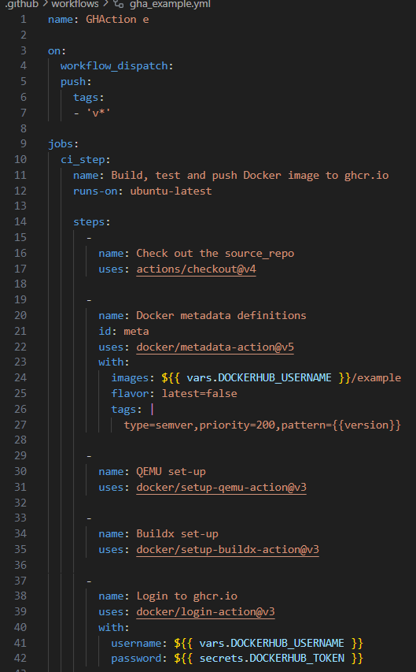
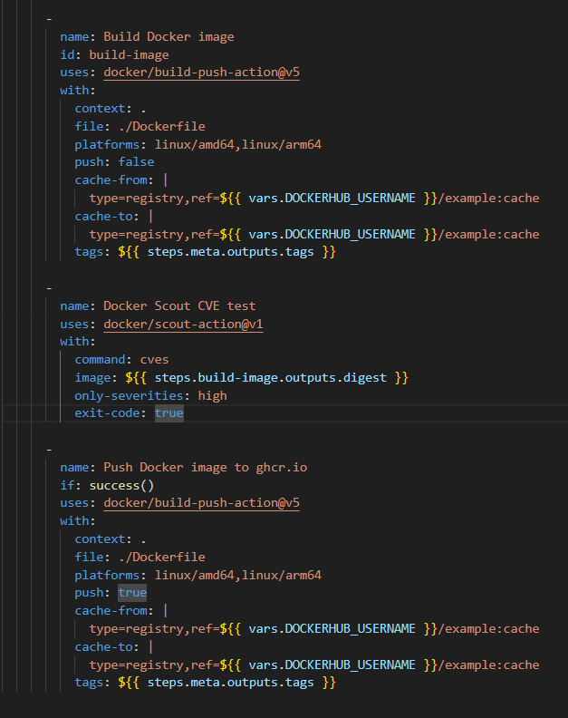
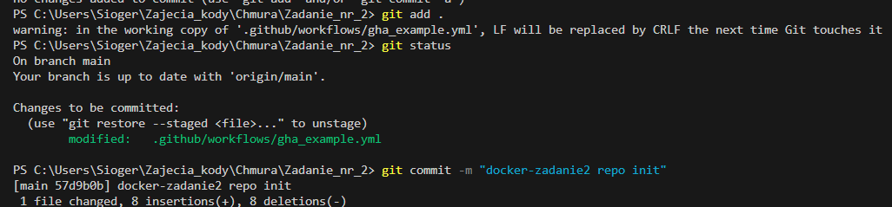
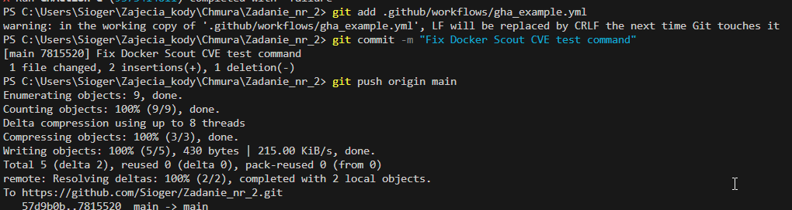
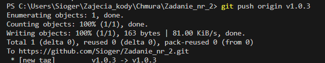
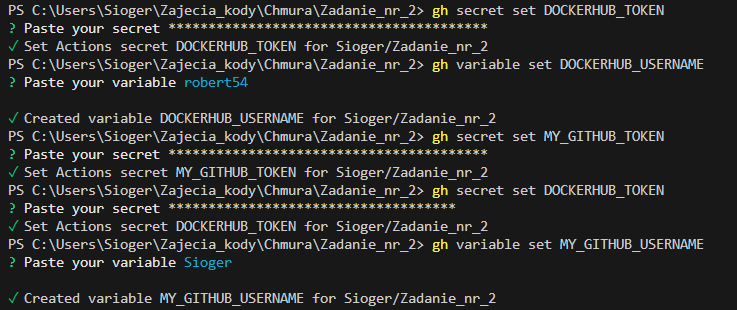
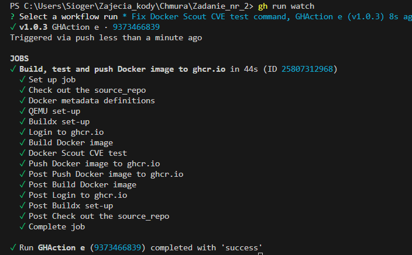
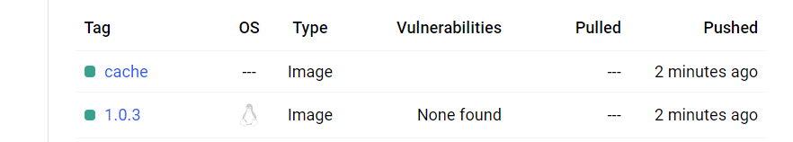

# CI/CD Pipeline dla Aplikacji Python w Dockerze i Serwera BusyBox

## Opis

To repozytorium zawiera pipeline CI/CD skonfigurowany za pomocą GitHub Actions do budowania, testowania i wdrażania obrazów Dockerowych dla aplikacji Pythona oraz statycznego serwera obsługiwanego przez BusyBox. Pipeline obejmuje skanowanie podatności za pomocą Docker Scout, aby zapewnić, że obrazy są wolne od podatności o wysokim stopniu zagrożenia przed ich przesłaniem do GitHub Container Registry (ghcr.io).

## Konfiguracja CI/CD Pipeline

CI/CD pipeline jest zdefiniowany w pliku `gha_example.yml` znajdującym się w katalogu `.github/workflows/`. 




Workflow wykonuje następujące kroki:
1. **Checkout Repozytorium:**
   - Wykorzystuje akcję `actions/checkout@v4` do pobrania repozytorium.

2. **Definiowanie Metadanych Dockerowych:**
   - Używa akcji `docker/metadata-action@v5` do zdefiniowania metadanych dla obrazu Dockerowego.

3. **Konfiguracja QEMU i Buildx:**
   - Używa akcji `docker/setup-qemu-action@v3` i `docker/setup-buildx-action@v3` do konfiguracji QEMU i Buildx dla budowania na wiele platform.

4. **Logowanie do ghcr.io:**
   - Używa akcji `docker/login-action@v3` do zalogowania się do GitHub Container Registry.

5. **Budowa Obrazu Dockerowego:**
   - Używa akcji `docker/build-push-action@v5` do budowy obrazu Dockerowego dla platform `amd64` i `arm64` bez przesyłania go jeszcze.

6. **Skanowanie Obrazu Dockerowego pod kątem CVE:**
   - Używa akcji `docker/scout-action@v1` do skanowania obrazu Dockerowego pod kątem podatności klasyfikowanych jako krytyczne. Budowa nie powiedzie się, jeśli zostaną znalezione jakiekolwiek podatności klasyfikowane jako krytyczne.

7. **Przesyłanie Obrazu Dockerowego do ghcr.io:**
   - Jeśli skanowanie CVE zostanie zakończone sukcesem, obraz Dockerowy zostanie przesłany do ghcr.io.

## Jak Uruchomić Pipeline

1. **Przesłanie do Głównej Gałęzi lub Utworzenie Tagu:**
   - Pipeline jest uruchamiany przez przesłanie do głównej gałęzi lub poprzez utworzenie tagu zaczynającego się od `v*`.

2. **Ręczne Uruchomienie:**
   - Możesz ręcznie uruchomić workflow za pomocą zdarzenia `workflow_dispatch`.

## Przygotowania do wysyłania








## Jak Skonfigurować Sekrety

Aby użyć tego pipeline'u, musisz skonfigurować następujące sekrety w ustawieniach repozytorium GitHub:

- **GHCR_USERNAME:** Twoja nazwa użytkownika na GitHub.
- **GHCR_TOKEN:** Token GitHub z uprawnieniami do zapisu w GitHub Container Registry.



## Wysłanie na Github



## Sprawdzenie na Dockerhub



## Sprawdzenie na Github w repozytorium projektu w Actions


## Przykładowy Index.html

Statyczna strona serwowana przez BusyBox zawiera prosty plik `index.html` znajdujący się w katalogu `src/`:

```html
<!DOCTYPE html>
<html>
<head>
    <title>Moja Statyczna Strona</title>
</head>
<body>
    <h1>Witaj na Mojej Statycznej Stronie</h1>
<p>To jest statyczna strona serwowana przez serwer BusyBox HTTP.</p>

</body>
</html>
```
Aplikacja Pythonowa
Aplikacja Pythonowa, znajdująca się w katalogu app/, zawiera prosty serwer HTTP zaimplementowany w pliku server.py oraz jego zależności wymienione w pliku requirements.txt.

server.py

```php
import http.server
import socketserver
import logging
from datetime import datetime
import pytz

PORT = 8000
AUTHOR = "Jan Kowalski"

# Konfiguracja logowania
logging.basicConfig(filename='server.log', level=logging.INFO)
logging.info(f"Serwer uruchomiony o {datetime.now()} przez {AUTHOR} na porcie {PORT}")

class MyHandler(http.server.SimpleHTTPRequestHandler):
    def do_GET(self):
        client_ip = self.client_address[0]
        client_timezone = pytz.timezone('Etc/UTC')  # Domyślnie UTC, może być dostosowany na podstawie IP
        client_time = datetime.now(client_timezone)
        
        response = f"""
        <html>
        <body>
        <h1>IP klienta: {client_ip}</h1>
        <h2>Aktualna data i czas w twojej strefie czasowej: {client_time.strftime('%Y-%m-%d %H:%M:%S %Z%z')}</h2>
        </body>
        </html>
        """
        self.send_response(200)
        self.send_header("Content-type", "text/html")
        self.end_headers()
        self.wfile.write(response.encode('utf-8'))

with socketserver.TCPServer(("", PORT), MyHandler) as httpd:
    logging.info(f"Serwowanie na porcie {PORT}")
    httpd.serve_forever()

```
requirements.txt

```txt
pytz
```

Dockerfile

Dockerfile dla Aplikacji Pythonowej

```dockerfile
# Etap 1: Etap budowania
FROM python:3.9-slim as build

LABEL maintainer="robert54"

WORKDIR /app

# Instalacja zależności
COPY requirements.txt .
RUN pip install --no-cache-dir -r requirements.txt

# Kopiowanie kodu serwera
COPY server.py .

# Etap 2: Finalny obraz
FROM python:3.9-slim

LABEL maintainer="robert54"

WORKDIR /app

# Kopiowanie zbudowanych plików z poprzedniego etapu
COPY --from=build /app /app

EXPOSE 8000

CMD ["python", "server.py"]

```

Dockerfile dla Serwera BusyBox HTTP
```dockerfile
FROM busybox:1.35

# Utworzenie użytkownika, który będzie właścicielem plików serwera httpd
RUN adduser -D static
USER static
WORKDIR /home/static

# Skopiowanie strony do katalogu roboczego
COPY src .

# Uruchomienie serwera BusyBox httpd
CMD ["busybox", "httpd", "-f", "-v", "-p", "3000"]

```
